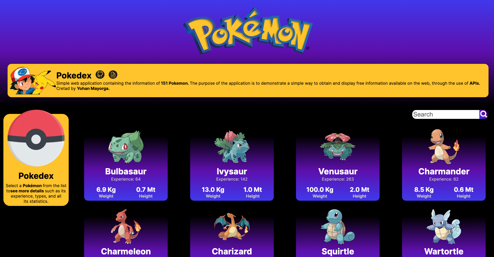
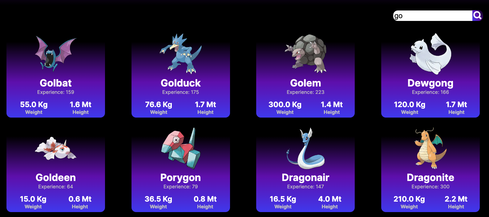
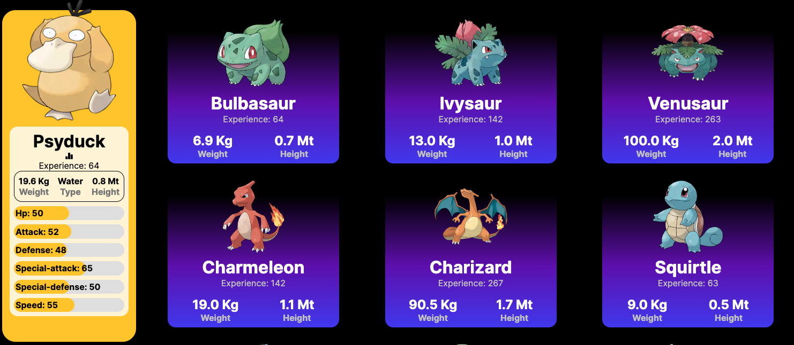

# Pokedex

Simple web application containing the information of 151 Pokemon. The purpose of the application is to demonstrate a simple way to obtain and display free information available on the web, through the use of APIs.



## Used tools

```bash
HTML, CSS, JavaScript, TypeScript, NextJS, Fetch, React, API.
```

## How does it work?

On the page you will find the complete list of available Pokemon. If you want to search for a particular Pokemon, you can use the search bar at the top, and the search will filter the results based on the name you type.


When you click on a Pokémon's name, the Pokedex will display the details of the selected Pokémon, its image, and its statistics.


## Learn More

This open source project is completely free to use, download and customize.

## Deploy on Vercel

The website is available at this [link.](https://pokedex-kt0s464md-yohanmayorgas-projects.vercel.app/)
